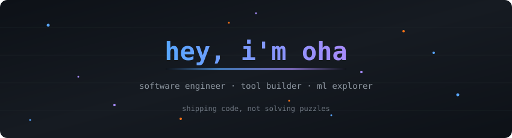

<p align="center">
  
</p>

<p align="center">
  <a href="https://github.com/duriantaco">
    
  </a>
  <a href="https://github.com/duriantaco?tab=repositories">
    
  </a>
  
</p>

<p align="center">
  
  
  
</p>


## 🧑‍💻 about me

```
$ cat about_oha.json
```

```json
{
  "currently_building": ["Skylos", "Fyn"],
  "ask_me_about": ["web dev", "ML", "cooking"],
  "hot_take": "inverting binary trees won't help you ship features",
  "fun_fact": "mass producing side projects since forever",
  "mood": "if it works in prod, it works"
}
```

<table>
  <tr>
    <td width="60%" valign="top">
      <h3>the tldr</h3>
      <ul>
        <li>i build tools that solve real problems, not toy demos</li>
        <li>AI is a force multiplier, not a replacement for thinking</li>
        <li>shipping > theorizing. my github is my resume</li>
        <li>also i cook. a lot. 🍳</li>
      </ul>
    </td>
    <td width="40%" align="center">
      
      <br><br>
      <b>the real boss around here</b>
    </td>
  </tr>
</table>


## 🚀 stuff i built

<table>
  <tr>
    <td width="50%" valign="top">
      <h3><a href="https://github.com/duriantaco/skylos">🔍 Skylos</a></h3>
      <p>Open-source Python, TypeScript & Go SAST with dead code detection. Finds secrets, exploitable flows, and AI regressions.</p>
      <p>
        
        
        
      </p>
    </td>
    <td width="50%" valign="top">
      <h3><a href="https://github.com/duriantaco/fyn">⚡ Fyn</a></h3>
      <p>Fast Python package management, dependency resolution, virtual environments, and pyproject.toml workflows. Built in Rust.</p>
      <p>
        
        
        
      </p>
    </td>
  </tr>
  <tr>
    <td width="50%" valign="top">
      <h3><a href="https://github.com/duriantaco/jonq">🔧 jonq</a></h3>
      <p>Query JSON with SQL-like syntax. A readable jq alternative with table, CSV, YAML output and interactive REPL.</p>
      <p>
        
        
        
      </p>
    </td>
    <td width="50%" valign="top">
      <h3><a href="https://github.com/duriantaco/vouch">🧾 Vouch</a></h3>
      <p>Compile human-owned intent into obligations, link evidence artifacts, and produce deterministic release decisions for agent-written changes.</p>
      <p>
        
        
        
      </p>
    </td>
  </tr>
</table>


<details open>
<summary><b>🛠 tech stack</b></summary>
<br>

<p align="center">
  
  
  
  
  
  
  
  
  
  
  
  
  
  
  
  
  
  
  
  
  
</p>

</details>


<details open>
<summary><b>📊 the receipts</b></summary>
<br>

<p align="center">
  
</p>

<p align="center">
  
  
</p>

<p align="center">
  
  
</p>

<div align="center">


</div>

</details>


## 📬 hit me up

<p align="center">
  <a href="mailto:aaronoh2015@gmail.com">
    
  </a>
</p>

<br>

<!-- Easter Egg -->
<!--
Ola!
If you're reading this, welcome!
Here's a secret.. I hide easter eggs in some of my projects LOL.
Happy hunting and good luck :) 🥚
-->

<p align="center">
  <sub>built with mass amounts of caffeine and ctrl+c ctrl+v</sub>
</p>
