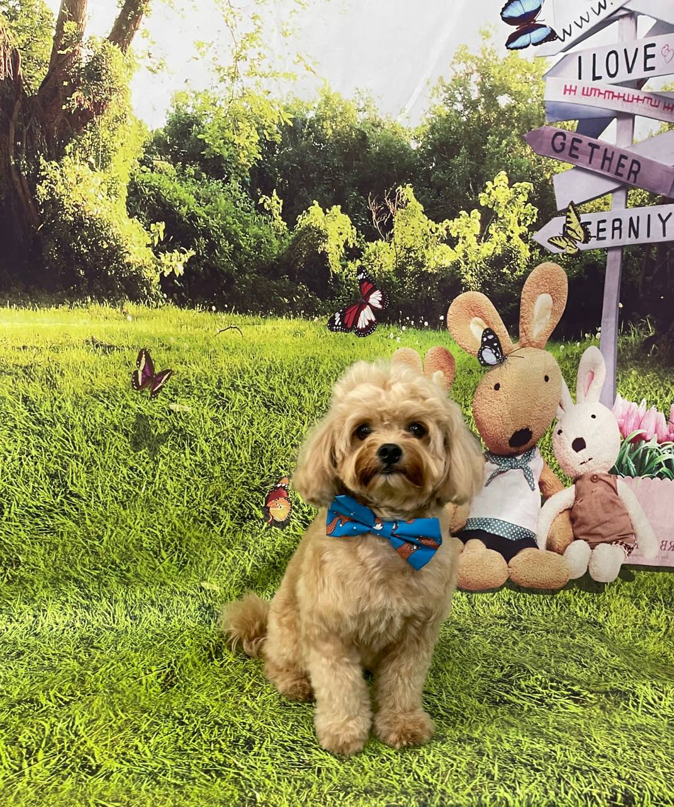

<div align="center">
  
</div>

<div align="center">
  
  [](https://git.io/typing-svg)
  
  <br>
  
  [](https://github.com/duriantaco)
  [](https://github.com/duriantaco?tab=repositories)
  
</div>


##  My inspiration

<div align="center">
  
  <br>
</div>

##  About Me


```javascript
const oha = {
    location: "Singapore 🇸🇬",
    currentFocus: "Building Skylos",
    askMeAbout: ["Web Dev", "Cloud", "ML", "Coffee ☕"],
    technologies: {
        frontEnd: {
            js: ["React", "Redux", "TypeScript"],
            css: ["Styled Components", "Tailwind"]
        },
        backEnd: {
            python: ["Django", "Flask", "FastAPI"],
            js: ["Node", "Express"],
            databases: ["PostgreSQL", "MongoDB", "Redis"]
        },
        cloud: ["AWS", "Docker", "Kubernetes"],
        ml: ["PyTorch", "OpenCV", "Pandas"]
    },
    currentProject: "Skylos - Next-gen cloud platform",
    funFact: "I debug with console.log and I'm proud of it!"
    controversialOpinions: {
        leetcode: "Your ability to invert a binary tree in O(log n) means nothing if you can't ship features",
    }
};
```

## 💡 Coding Philosophy

<div align="center">

```text
"First, solve the problem. Then, write the code." - John Johnson

Leverage AI as a force multiplier, not a replacement for thinking. AI accelerates development and explores solutions, but every suggestion must be questioned, understood, and validated. The best code comes from human creativity augmented by AI efficiency, not blind copy paste. Code is a means to an end. 

The future belongs to those who can architect solutions and validate AI output. I solve actual problems, not arbitrary puzzles. My GitHub is my resume.
```

</div>

## GitHub Analytics

<div align="center">
  <a href="https://github.com/duriantaco">
    
  </a>
  <a href="https://github.com/duriantaco">
    
  </a>
</div>

<div align="center">
  
</div>

<div align="center">


</div>


## Tech Universe

<div align="center">

### Frontend


### Backend


### Cloud


### AI/ML


</div>

## Featured Project

<div align="center">
  <a href="https://github.com/duriantaco/skylos">
    
  </a>
</div>

## Contribution Graph

<div align="center">
  
</div>


## Let's Connect!

<div align="center">
  
  [](mailto:aaronoh2015@gmail.com)
  
</div>

<div align="center">
  
</div>


<!-- Easter Egg -->
<!--
Ola! 
If you're reading this, welcome!
Here's a secret.. I hide easter eggs in some of my projects LOL.
Happy hunting and good luck :) 🥚
-->

<div align="center">
  <br>
  
</div>